## EC2 Demo

 * **AMI**: *Microsoft Windows Server 2016 Base*

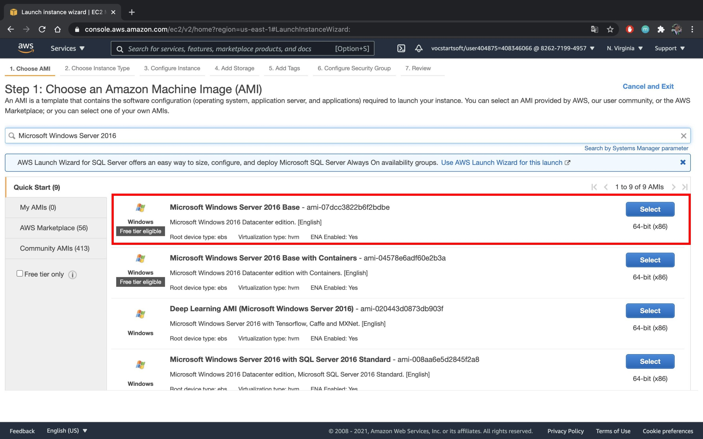

 * **Instance Type**: *t2.medium*
 
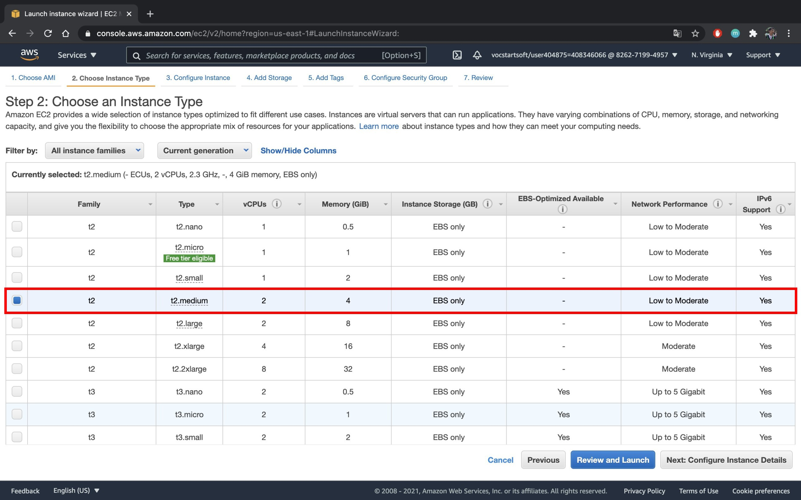

 * Click **Next** on all the steps and click **Launch**
  
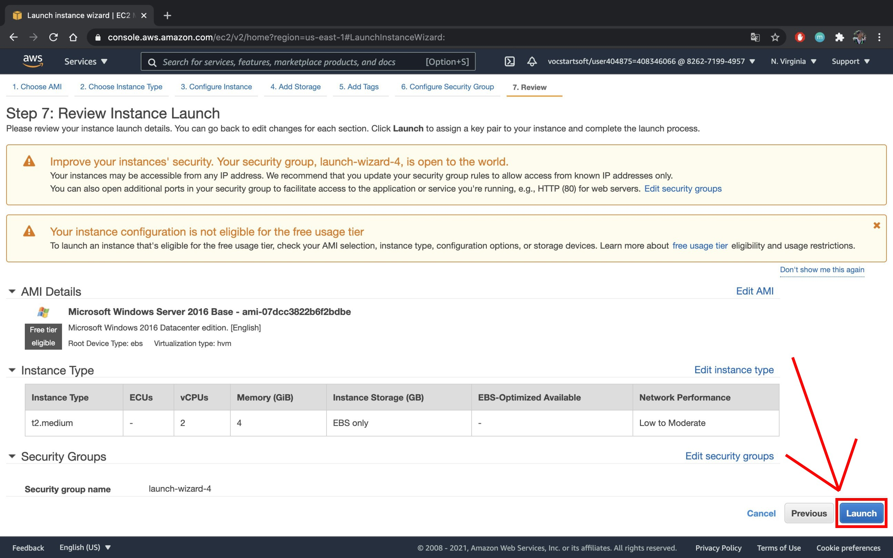

 * **Create a new key pair** give it a **Key pair name** and **Download Key Pair**
  
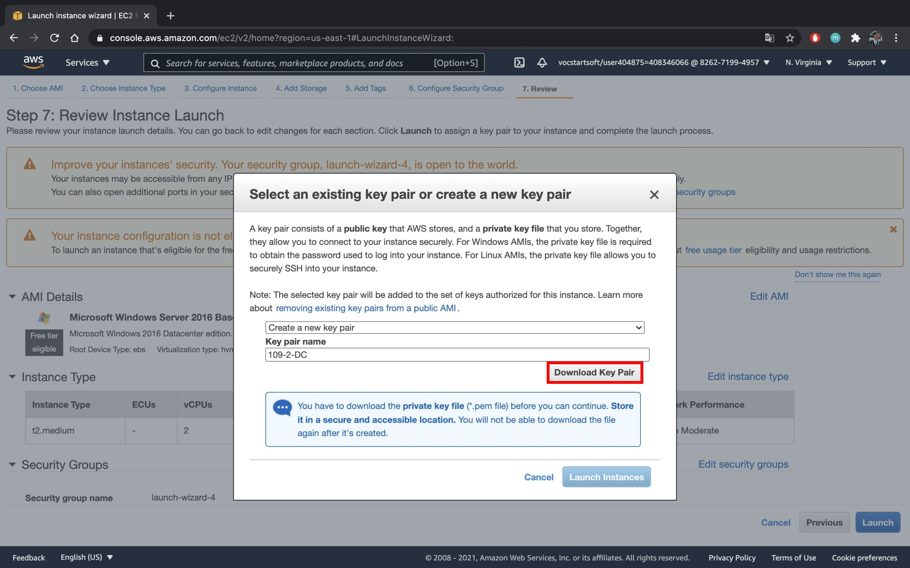

 * Click **Launch Instances**
  
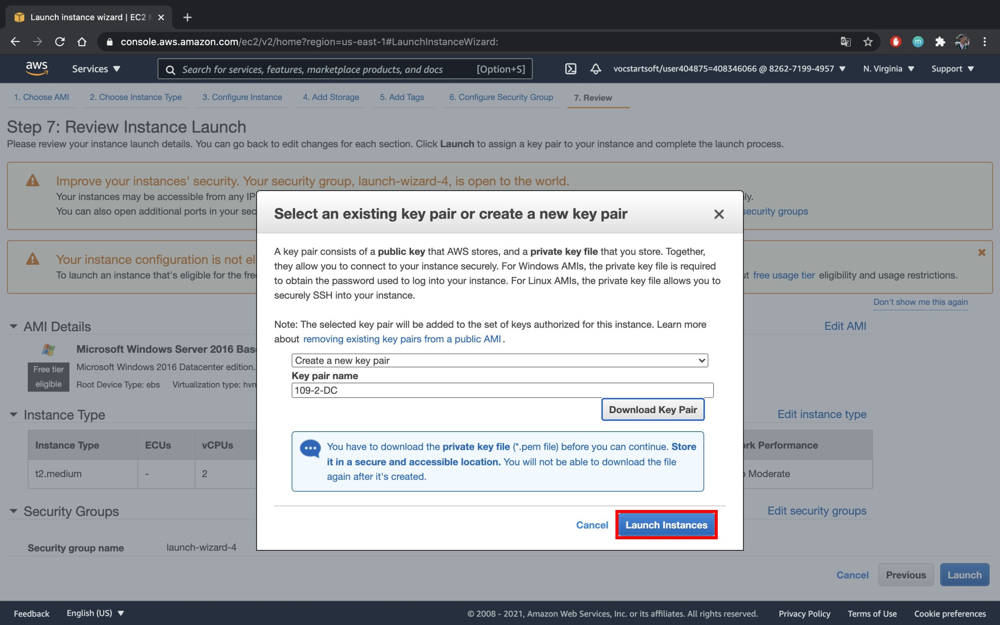

 * Wait until the **Instance state** turns ***Running*** and click **Connect**
  
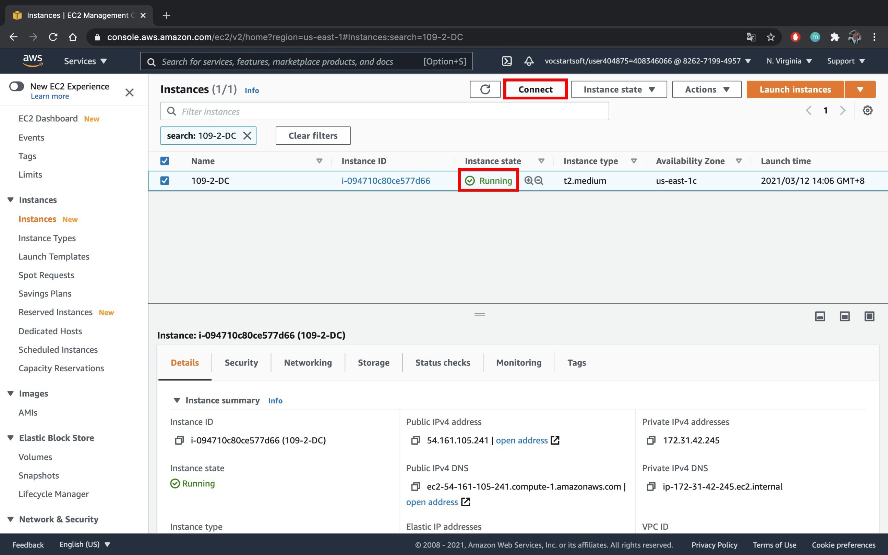

 ### **(Windows User)** 
 * Click **RDP Client** and click **Download remote desktop file**
  
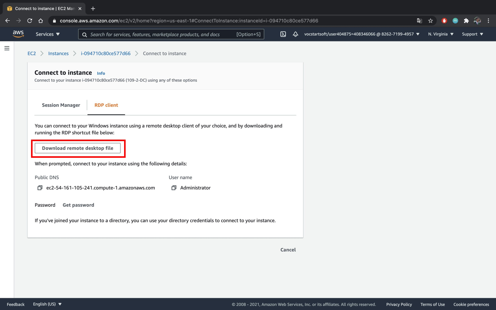

 ### **(MacOS User)**
 * First, download **Microsoft Remote Deskytop** in your **App Store**
 
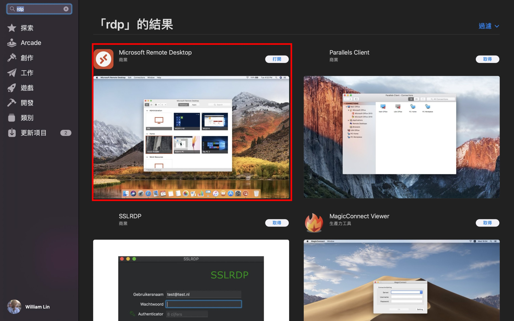

 * Second, back to AWS Console, click **RDP Client** and click **Download remote desktop file**
 

 * The file will look like the picture below:
  
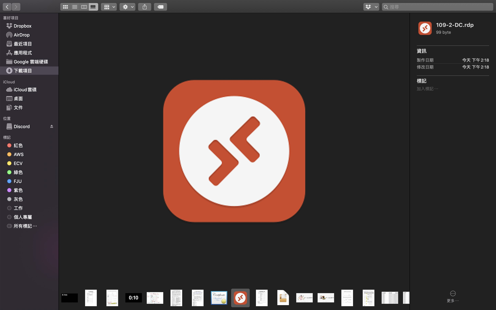

 * *Password*: Click **Get password**
  
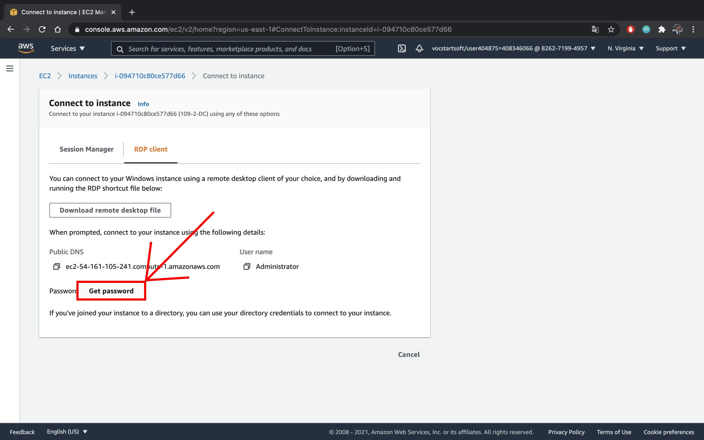

 * Click **Browse** and select **the key file download in the previous step**, then click **Decrypt Password**

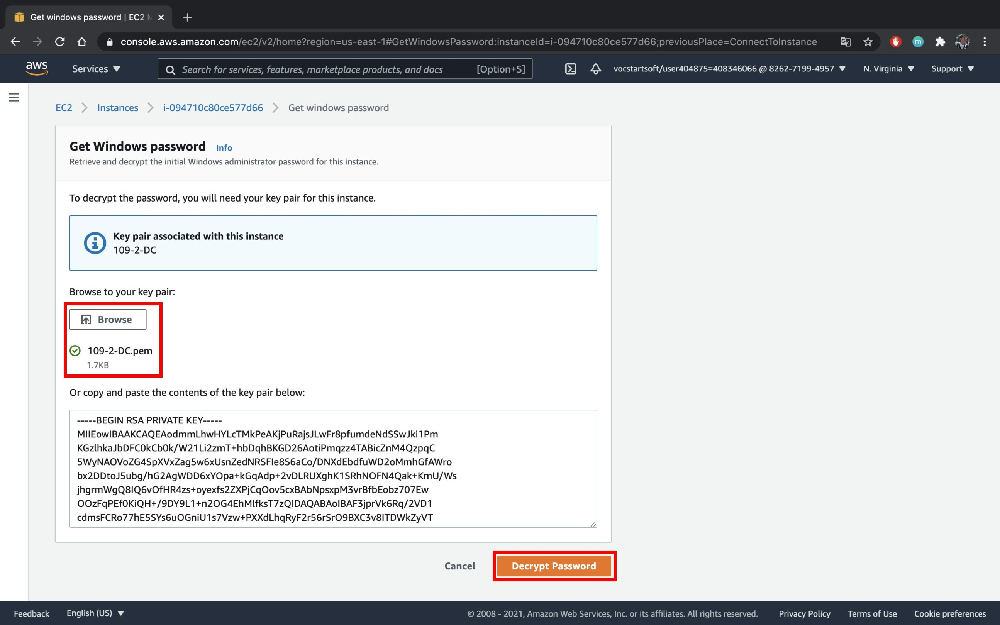

 * Open the RDPFile, and input the decrypted password
 
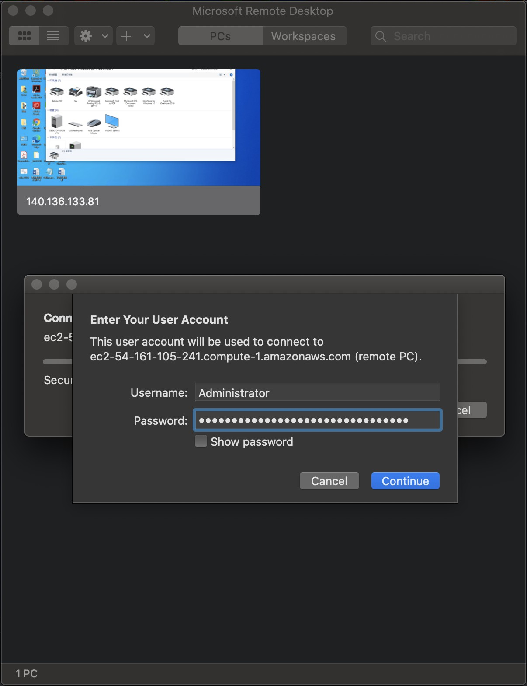

 ## Turn off and disable UAC in Windows 10

 * [Turn off and disable UAC in Windows 10](https://winaero.com/how-to-turn-off-and-disable-uac-in-windows-10/)

 ## Turn off Firewall and Security
* Turn off these three in the picture: 
  
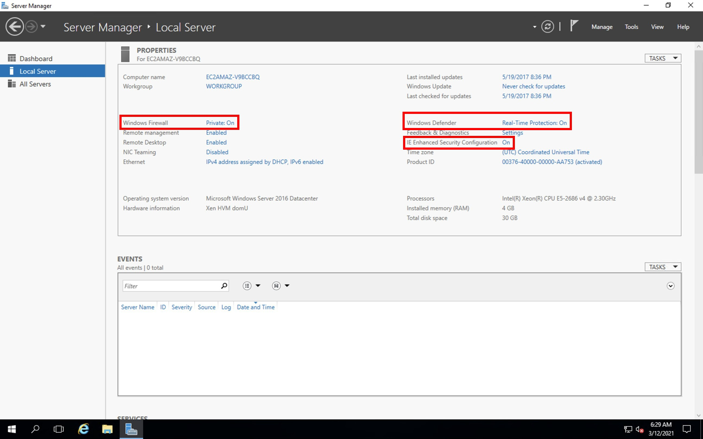

