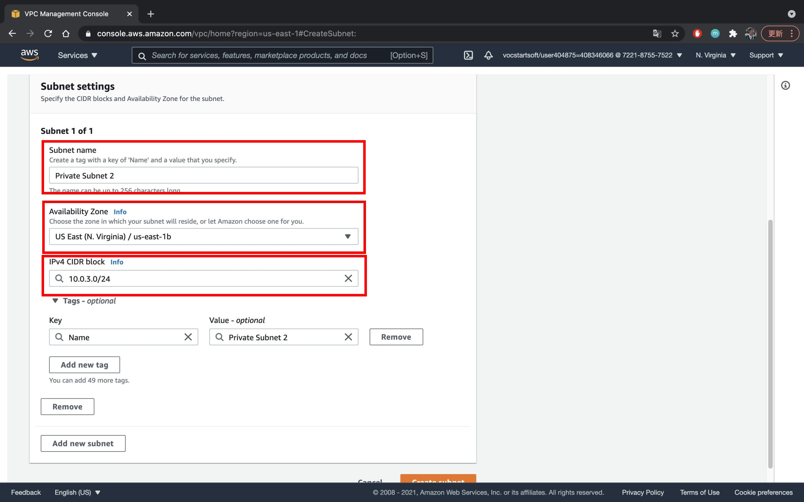

## VPC Demo

### VPC
* On the VPC webpage, click **Elastic IPs** on the left navigation panel

* Click **Allocate Elastic IP**

* Do not change any settings, click **Allocate**

* Back to the **VPC Dashboard** by clicking it on the left-top of the webpage, click **Launch VPC Wizard**

* Select ***VPC with Public and Private Subnets*** and click **Select**

> *If you know how to split CIDR range you can set up by your own, but we do not change the CIDR range in my demo*

* Give your **VPC Name** a value, and select the **Elastic IP** you just allocated

* Click **Create VPC**, wait until it's finished

### Subnet
* Click **Subnet** on the left navigation panel

#### Additional Private Subnet
* Click **Create Subnet**

* Choose the VPC we created in the previous step

* Input the value as the picture below:
    * ***Subnet Name***: *Private Subnet 2*
    * ***Availability Zone***: *Different Availability Zone than your original subnets in the VPC*
    > Example: Original: us-east-1a, Subnet 2: us-east-1b
    * ***IPv4 CIDR block***: *10.0.3.0/24*

* Click **Create Subnet**

#### Additional Public Subnet

* Repeat the same steps in [Additional Private Subnet](#additional-private-subnet)

* Change the value as below:
    * ***Subnet Name***: *Public Subnet 2*
    * ***Availability Zone***: *Different Availability Zone than your original subnets in the VPC*
    > Example: Original: us-east-1a, Subnet 2: us-east-1b
    * ***IPv4 CIDR block***: *10.0.2.0/24*